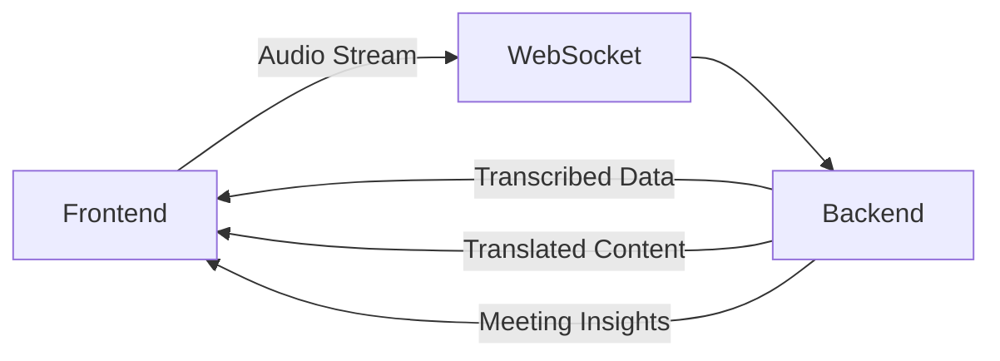
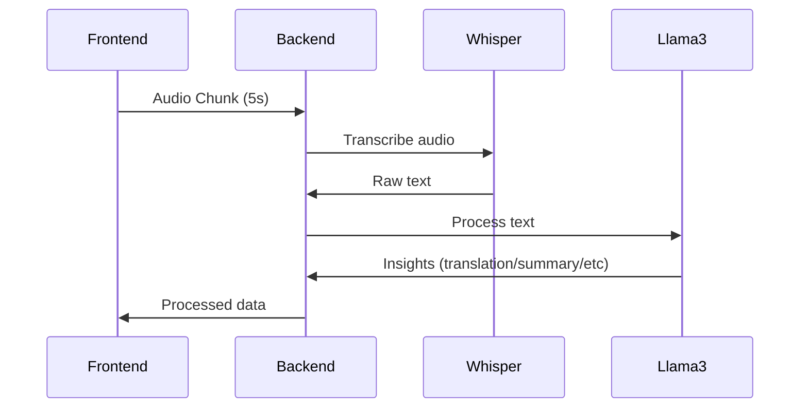
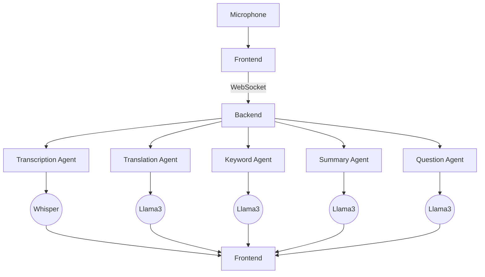

# 🌐 Polyglot Meeting Whisperer

Polyglot Meeting Whisperer is a real-time meeting assistant that captures microphone audio in chunks, transcribes it, translates it, summarizes it, generates questions and extracts & explains buzz keywords — all using AI agents.

## 🧠 Project Overview



### ✨ Core Features
- 🎧 **Real-time Audio Transcription**
- 🌍 **Multilingual Translation**
- 📝 **AI-Powered Summarization**
- 🔑 **Keyword Extraction & Explanation**
- ❓ **Intelligent Question Generation**

## 👥 Team Members
| Name                   | Role               |
|------------------------|--------------------|
| Abbas Al-Kaisi         | AI + Full Stack Lead |
| Gabriel Calderon       | Project Lead       |
| Wajeeha Ghazi          | UI-UX Designer     |
| Khadeeja               | Documentation Lead |
| Muhammad Faizan Soomro | Full Stack + AI Lead |
| Muhammad Jasim         | AI Specialist      |
| Muhammad Abdullah Bilal| Frontend Developer |
| Fawad Malik            | AI Specialist      |

## 📂 Project Structure
```
polyglot-meeting-whisperer/
├── frontend/            # React application
│   └── README.md        # Frontend documentation
├── backend/             # Python WebSocket server
│   └── README.md        # Backend documentation
├── LICENSE.md           # MIT License
└── README.md            # Main project overview (you are here)
```

## 🚀 Getting Started

### Prerequisites
- Node.js v16+ (frontend)
- Python 3.8+ (backend)
- Groq API key (backend)

### Installation
1. Clone the repository:
```bash
git clone https://github.com/Muhammad-Faizan-Soomro/polyglot-meeting-whisperer.git
cd polyglot-meeting-whisperer
```

2. Set up both components:
```bash
# Frontend setup
cd frontend
npm install

# Backend setup
cd ../backend
pip install -r requirements.txt
```

3. Configure environment variables:
```bash
# Backend .env file
echo "GROQ_API_KEY=your_api_key_here" > backend/.env
```

4. Run the system:
```bash
# In separate terminals:
# Terminal 1 - Start backend
cd backend && python websocket_server.py

# Terminal 2 - Start frontend
cd frontend && npm start
```

## 📚 Detailed Documentation
| Component | Documentation | Key Technologies |
|-----------|---------------|------------------|
| **Frontend** | [Frontend README](frontend/README.md) | React, Tailwind CSS, WebSocket API |
| **Backend** | [Backend README](backend/README.md) | Python, Whisper, Llama3, WebSockets |

## 🌟 Key Features Deep Dive

### 🤖 AI-Powered Processing Pipeline


### ⚡ Real-Time Performance
- 5-second audio chunk processing
- Parallel agent execution
- WebSocket streaming
- Low-latency responses (200-500ms)

### 📊 Data Flow Architecture


## 📜 License
This project is licensed under the MIT License - see the [LICENSE.md](LICENSE.md) file for details.
